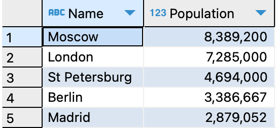

# WORLD

This project is a comprehensive analysis tool for a world dataset featuring information about cities, countries, and their populations. It utilizes MySQL for efficient data querying, sorting, and filtering, offering valuable insights for researchers, data analysts, and enthusiasts interested in global demographic trends.

## Dataset
The World Dataset Analysis tool leverages a comprehensive dataset, originally sourced from Statistics Finland, http://www.stat.fi/worldinfigures. It provides a wealth of information about global demographics. It's designed to assist researchers and enthusiasts in uncovering patterns and insights into population dynamics, urbanization trends, and socio-economic factors on a global scale.

### Attribute Information
**Country Table**

| Attribute       | Data Type | Description  |
|-----------------|-----------|--------------|
| `Code`          | CHAR      | A unique three-letter code identifying each country. It's the primary key for this table. |
| `Name`          | CHAR      | The official name of the country. |
| `Continent`     | ENUM      | The continent on which the country is located. Possible values are Asia, Europe, North America, Africa, Oceania, Antarctica, and South America. |
| `Region`        | CHAR      | The specific region or area where the country is situated. |
| `SurfaceArea`   | DECIMAL   | The total surface area of the country in square kilometers. |
| `IndepYear`     | SMALLINT  | The year of independence of the country. This can be null if the country was never colonized or the data is not available. |
| `Population`    | INT       | The total number of people living in the country. |
| `LifeExpectancy`| DECIMAL   | The average life expectancy of individuals in the country. Can be null if data is not available. |
| `GNP`           | DECIMAL   | The Gross National Product of the country. Can be null if data is not available. |
| `GNPOld`        | DECIMAL   | The Gross National Product of the country in the previous year. Used to compare GNP growth or decline. Can be null if data is not available. |
| `LocalName`     | CHAR      | The name of the country in the local official language. |
| `GovernmentForm`| CHAR      | The form or system of government ruling the country. |
| `HeadOfState`   | CHAR      | The name of the current head of state. Can be null if the position is not applicable or data is not available. |
| `Capital`       | INT       | A reference ID to a table of cities, indicating the capital city of the country. Can be null if the capital city is not designated or data is not available. |
| `Code2`         | CHAR(2)   | A secondary two-letter code for the country, often used as a standard country code in international agreements or organizations. |

Key Constraint:
- PRIMARY KEY (`Code`) - Ensures each country is uniquely identified by its code.
 
**City**

| Attribute    | Data Type | Description  |
|--------------|-----------|--------------|
| `ID`         | INT       | A unique identifier for each city. It's an auto-increment field, meaning each new city automatically gets a unique number. |
| `Name`       | CHAR(35)  | The name of the city. |
| `CountryCode`| CHAR(3)   | A three-letter code that identifies the country the city is located in. This is a foreign key that links to the `Code` attribute in the `country` table. |
| `District`   | CHAR(20)  | The district or area within the country where the city is located. |
| `Population` | INT       | The total population of the city. |

Key Constraints:
- PRIMARY KEY (`ID`) - Ensures each city is uniquely identified by its ID.
- FOREIGN KEY (`CountryCode`) REFERENCES `world`.`country` (`Code`) - Ensures each city is associated with a valid country.

Indexes:
- INDEX on `CountryCode` (to optimize search operations and joins with the `country` table).

**Country Language**

| Attribute     | Data Type | Description  |
|---------------|-----------|--------------|
| `CountryCode` | CHAR(3)   | A three-letter code that identifies the country. This is a foreign key that links to the `Code` attribute in the `country` table. |
| `Language`    | CHAR(30)  | The name of the language spoken in the country. |
| `IsOfficial`  | ENUM('T', 'F') | Indicates whether the language is an official language in the country. 'T' stands for True, and 'F' stands for False. |
| `Percentage`  | DECIMAL(4,1) | The percentage of the country's population that speaks the language. |

Key Constraints:
- PRIMARY KEY (`CountryCode`, `Language`) - A composite key ensuring that each language is listed only once per country.
- FOREIGN KEY (`CountryCode`) REFERENCES `world`.`country` (`Code`) - Ensures referential integrity by linking each language to a valid country code.

Index:
- INDEX on `CountryCode` (to optimize search operations and joins with the `country` table).


## Technologies Used
This project is built using MySQL 8.0 and Python 3.10. Additional data analysis is performed using Python libraries such as Pandas for data manipulation and Seaborn for data visualization.

## Features
Query information about cities and countries. Sort data by population, area, GDP, etc.
Advanced filtering options to pinpoint specific data. Users can apply complex filters to their queries, such as population density ranges, GNP thresholds, or even surface area parameters, to extract tailored insights from the global dataset.

## Installation and Setup
Install MySQL: [Download link](https://dev.mysql.com/downloads/installer/)

Import the world dataset: [Setting up the world database](https://dev.mysql.com/doc/world-setup/en/)

After installing MySQL from the provided link, set up the world database by running the world.sql script included in the repository. This script creates all necessary tables and imports initial data. 

## Usage

```
-- Discover the top 5 most populous cities in Europe 
SELECT city.Name, city.Population 
FROM city 
INNER JOIN country ON city.CountryCode = country.Code
WHERE country.Continent = 'Europe' 
ORDER BY city.Population DESC 
LIMIT 5;
```
This query lists the top 5 most populous cities in Europe, showcasing the project's capability to perform complex, continent-specific queries.

[//]: # (![Query Screenshot]&#40;assets/top5-query.png&#41;)

<p align="center">

</p>

## Diagram
Diagram of the relation between different tables

[//]: # (![Diagram]&#40;assets/diagram.png&#41;)

<p align="center">

</p>

## Visual Representation
In this section, I dug deep into the graphical representation of our dataset, offering a visual perspective of the intricate relationships and distributions within the data. These visualizations not only enhance our understanding of the dataset but also enable us to observe patterns and insights that might not be apparent from the raw data alone.

1. **Histogram of Life Expectancy**:
The histogram displays the distribution of life expectancy across the countries in the dataset. Most countries seem to have a life expectancy between 60 and 80 years, although there's also a significant amount with a life expectancy below 60 years.


***

2. **Relation between population and GNP**: 
The histogram displays the distribution of life expectancy across the countries in the dataset. Most countries seem to have a life expectancy between 60 and 80 years, although there's also a significant amount with a life expectancy below 60 years.


***

3. **GNP by Continent**: The bar chart shows the Gross National Product (GNP) average for countries on each continent. There's significant variation in the average GNP among different continents, which might reflect differences in economic status, resource availability, policies, among other factors.


***

4. **Life Expectancy by Region**: The boxplot shows the distribution of life expectancy among different regions. The lines inside the boxes indicate the median life expectancy, while the boxes themselves represent the interquartile range (between the 25th and 75th percentile). The dots are outliers that do not fit within the typical range for each region. This chart highlights differences in life expectancy among regions, which may be indicative of differences in economic development, access to medical services, nutrition, among other factors.


***

5. **Correlation Heatmap**: The heatmap of correlation coefficients provides a dense visual summary of how different variables in the dataset are related to each other. This plot helps in identifying pairs of variables that have a strong positive or negative correlation, enabling a deeper understanding of the interdependencies within the data.


## Contribution Guidelines
To contribute, please fork the repository and submit a pull request with your suggested changes. For major changes, please open an issue first to discuss what you would like to change.

## Contact Information
For support or queries, reach out to me at [my email address](mailto:albertevieites@gmail.com).

## Acknowledgements
Special thanks to [Yusuf Satilmis](https://github.com/yusufsjustit) for his invaluable assistance in this project.

